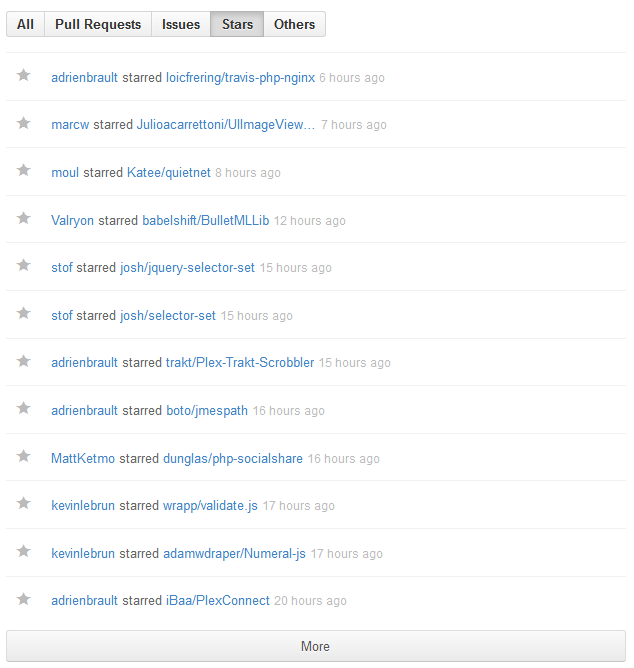
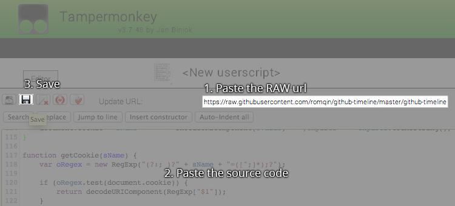

# [Github Timeline](https://github.com/romqin/github-timeline)

Filter your Github timeline by pull requests, issues, stars ...

Example:  

---

### Install for Firefox

 * First step, you will need to download Greasemonkey from [here](https://addons.mozilla.org/en-US/firefox/addon/greasemonkey/)
 * After you installed Greasemonkey and restarted Firefox, download the script from [here](https://github.com/downloads/romqin/github-timeline/github-timeline.js).
 * You will be promopted for the installation, after you click install you are done!
 * Now you are ready to use it

### Install for Opera

 * Go to 'Preferences' (CTRL+F12) > Advanced > Content > Javascript Options
 * Choose your 'User Javascript folder', somewhere nice
 * Right click [here](https://github.com/downloads/romqin/github-timeline/github-timeline.js) > 'Save Content Link As'
 * Put it in your special nice javascript folder you just made and you are done. :)

### Install for Chrome

 * Install [Tampermonkey](https://chrome.google.com/webstore/detail/tampermonkey/dhdgffkkebhmkfjojejmpbldmpobfkfo)
 * Create a new script like these:

### Install for Safari

 * Install [NinjaKit](http://ss-o.net/safari/extension/NinjaKit.safariextz) and restart Safari
 * Then click [here](https://github.com/downloads/romqin/github-timeline/github-timeline.js)

### Install for IE

* Go [download Firefox](http://www.mozilla.org/en-US/firefox/is-better-than-ie)
* Read Install for Firefox ;)
